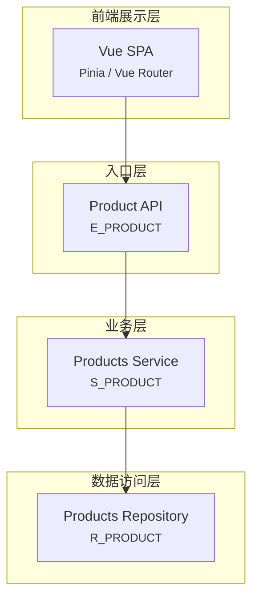

# ============================================================
# CodeArch — Reference Manual
# ============================================================
# Language-specific rules, schema definitions, color palette,
# and output format details. Consumed by SKILL.md.
# ============================================================

## systemData Schema (Full)

See SKILL.md Section 4 for the full schema. Key conventions:

- `layer` values: `entry` | `service` | `data` | `infra` | `external` | `job` | `event`
- `type` values: `Controller` | `Service` | `Repository` | `Entity` | `Router` | `Handler` | `Config` | `Client` | `Job` | `Consumer` | `Module`
- `confidence` values: `explicit` | `inferred` | `uncertain`
- `warnings[]` must be honest. Emit for: partial scans, inferred components, unknown project types.

---

## Language Packs

### java-spring

**Signals**: `pom.xml` OR `build.gradle` OR (`src/main/java` + `@RestController`)

**Directories → Layer/Type**:

| Directory | Type | Layer |
|-----------|------|-------|
| `controller/` | Controller | entry |
| `controller/ai/` | Controller | entry |
| `controller/buyer/` | Controller | entry |
| `controller/logistics/` | Controller | entry |
| `controller/order/` | Controller | entry |
| `controller/product/` | Controller | entry |
| `controller/promotion/` | Controller | entry |
| `controller/seller/` | Controller | entry |
| `controller/system/` | Controller | entry |
| `service/` | Service | service |
| `service/impl/` | Service | service |
| `service/ai/` | Service | service |
| `service/buyer/` | Service | service |
| `service/logistics/` | Service | service |
| `service/mongo/` | Service | service |
| `service/notification/` | Service | service |
| `service/order/` | Service | service |
| `service/product/` | Service | service |
| `service/system/` | Service | service |
| `repository/` | Repository | data |
| `repository/ai/` | Repository | data |
| `repository/mongo/` | Repository | data |
| `repository/order/` | Repository | data |
| `repository/product/` | Repository | data |
| `repository/promotion/` | Repository | data |
| `repository/system/` | Repository | data |
| `entity/` | Entity | data |
| `entity/*/` | Entity | data |
| `model/` | Entity | data |
| `dto/` | Entity | data |
| `config/` | Config | infra |
| `ai/` (root module) | Component | service |
| `ai/agent/` | Component | service |
| `ai/controller/` | Controller | entry |
| `ai/provider/` | Component | infra |
| `ai/metrics/` | Component | service |
| `ai/nlp/` | Component | service |
| `ai/resilience/` | Component | service |
| `kg/` | Service | service |
| `kg/controller/` | Controller | entry |
| `kg/service/` | Service | service |
| `kg/entity/` | Entity | data |
| `rag/` | Service | service |
| `rag/vector/` | Client | infra |
| `rag/service/` | Service | service |
| `rag/retriever/` | Service | service |
| `vector/` | Service | service |
| `payment/` | Component | infra |
| `payment/gateway/` | Component | infra |
| `listener/` | Consumer | event |
| `domain/event/` | Consumer | event |
| `task/` | Job | job |

**Dependency Inference (Spring)**:

| Pattern | From → To | Confidence |
|---------|-----------|------------|
| `@Autowired` field type | Controller/Service → Service/Repository | explicit |
| Constructor `new X()` | Any → X | explicit |
| `@RequiredArgsConstructor` | Any → injected type | explicit |
| `implements Interface` | Component → Interface type | explicit |
| Package naming heuristic | Controller → Service (by convention) | inferred |
| `MongoRepository<,>` / `JPA` | Service → Repository | explicit |

**Routes (Spring)**:

| Annotation | Extract |
|------------|---------|
| `@GetMapping` | `method=GET` |
| `@PostMapping` | `method=POST` |
| `@PutMapping` | `method=PUT` |
| `@DeleteMapping` | `method=DELETE` |
| `@PatchMapping` | `method=PATCH` |
| `@RequestMapping` | `method=GET` (default) |

Path: extract `"..."` or `'...'` from `value=` or `path=`.

**Mermaid Colors (Spring)**:

```mermaid
classDef entry fill:#1a1a2e,stroke:#e94560,color:#fff
classDef service fill:#16213e,stroke:#0f3460,color:#e0e0e0
classDef data fill:#0f3460,stroke:#53d8fb,color:#fff
classDef infra fill:#1b1b2f,stroke:#a29bfe,color:#e0e0e0
classDef external fill:#2d2d44,stroke:#ffd93d,color:#fff
classDef job fill:#1b1b2f,stroke:#6bcb77,color:#fff
classDef event fill:#1b1b2f,stroke:#ff6b6b,color:#fff
```

---

### nodejs-express

**Signals**: `package.json` + `node_modules/` + (`routes/` OR `controllers/` OR `app.js`/`server.js`)

**Directories → Layer/Type**:

| Directory | Type | Layer |
|-----------|------|-------|
| `routes/` | Router | entry |
| `controllers/` | Controller | service |
| `services/` | Service | service |
| `models/` | Entity | data |
| `middlewares/` | Config | infra |
| `config/` | Config | infra |
| `utils/` | Config | infra |
| `clients/` | Client | external |
| `jobs/` | Job | job |
| `workers/` | Job | job |

**Dependency Inference (Node.js)**:

| Pattern | Confidence |
|---------|------------|
| `require('...')` or `import from` | explicit |
| `router.get/post/put/delete(path, handler)` | explicit (route) |
| `app.use(middleware)` | explicit |
| Controller name heuristic: `XController` → `XService` | inferred |
| `fs`, `path`, `crypto` stdlib imports | skip (not external) |

**Routes (Express)**:

Extract from `router.get(path, ...)`, `router.post(path, ...)`, `app.get(path, ...)`, etc.
Path: literal string from first argument.

**Mermaid Colors (Node.js)**:

```mermaid
classDef entry fill:#2d5016,stroke:#6bcb77,color:#fff
classDef service fill:#1a3a0f,stroke:#a8e063,color:#fff
classDef data fill:#0f2d1f,stroke:#53d8fb,color:#fff
classDef infra fill:#1a1a2e,stroke:#a29bfe,color:#e0e0e0
classDef external fill:#2d2d44,stroke:#ffd93d,color:#fff
classDef job fill:#1b1b2f,stroke:#ff9f43,color:#fff
classDef event fill:#1b1b2f,stroke:#ff6b6b,color:#fff
```

---

### python-fastapi

**Signals**: `requirements.txt` OR `pyproject.toml` + (`fastapi` OR `starlette` OR `flask` OR `django`)

**Directories → Layer/Type**:

| Directory | Type | Layer |
|-----------|------|-------|
| `routers/` or `routes/` | Router | entry |
| `controllers/` | Controller | service |
| `services/` | Service | service |
| `models/` or `schemas/` | Entity | data |
| `crud/` | Repository | data |
| `core/` or `config/` | Config | infra |
| `utils/` | Config | infra |
| `clients/` or `external/` | Client | external |
| `tasks/` or `jobs/` | Job | job |
| `consumers/` | Consumer | event |

**Dependency Inference (Python)**:

| Pattern | Confidence |
|---------|------------|
| `from x import y` / `import x` | explicit |
| `@router.get/post/put/delete` | explicit (route) |
| `@app.get` (FastAPI app) | explicit |
| `@app.route` (Flask) | explicit |
| `APIRouter()` + include_router | explicit |
| Naming convention: `router` → `service` | inferred |

**Routes (FastAPI)**:

Extract from `@router.get("/path")`, `@app.post("/path")`, `@router.api_route`.
Method from decorator name. Path from string argument.

**Mermaid Colors (Python)**:

```mermaid
classDef entry fill:#1c3144,stroke:#00d9ff,color:#fff
classDef service fill:#0d1b2a,stroke:#3a86ff,color:#fff
classDef data fill:#1b2d3e,stroke:#53d8fb,color:#fff
classDef infra fill:#1a1a2e,stroke:#a29bfe,color:#e0e0e0
classDef external fill:#2d2d44,stroke:#ffd93d,color:#fff
classDef job fill:#1b1b2f,stroke:#6bcb77,color:#fff
classDef event fill:#1b1b2f,stroke:#ff6b6b,color:#fff
```

---

### go-stdlib

**Signals**: `go.mod` + `*.go` files

**Directories → Layer/Type**:

| Directory | Type | Layer |
|-----------|------|-------|
| `cmd/` | Handler | entry |
| `internal/` (by convention) | Service | service |
| `pkg/` | Service | service |
| `handlers/` | Handler | entry |
| `services/` | Service | service |
| `models/` or `types/` | Entity | data |
| `repository/` or `store/` | Repository | data |
| `config/` | Config | infra |
| `middleware/` | Config | infra |
| `client/` | Client | external |
| `jobs/` | Job | job |

**Dependency Inference (Go)**:

| Pattern | Confidence |
|---------|------------|
| `import "package"` | explicit |
| `http.HandleFunc(path, handler)` | explicit |
| `router.Handle(path, handler)` (gorilla/mux) | explicit |
| `chi.Router` patterns | explicit |
| Constructor func returning struct | inferred |
| Interface satisfying via struct field | inferred |

**Routes (Go)**:

Extract from `http.HandleFunc`, `router.Handle`, `router.Method` (chi), `v1.POST` (Gin).
Path from string argument. Method from pattern (GET/POST/etc.) or default.

**Mermaid Colors (Go)**:

```mermaid
classDef entry fill:#003d5b,stroke:#00a8e8,color:#fff
classDef service fill:#001d3d,stroke:#0077b6,color:#fff
classDef data fill:#002855,stroke:#53d8fb,color:#fff
classDef infra fill:#1a1a2e,stroke:#a29bfe,color:#e0e0e0
classDef external fill:#2d2d44,stroke:#ffd93d,color:#fff
classDef job fill:#1b1b2f,stroke:#6bcb77,color:#fff
classDef event fill:#1b1b2f,stroke:#ff6b6b,color:#fff
```

---

## Vue 3 Frontend

**Signals**: `frontend/` directory + `package.json` containing `vue` + `src/` directory

**Directories → Layer/Type**:

| Directory | Type | Layer |
|-----------|------|-------|
| `src/views/` | View | frontend |
| `src/components/` | Component | frontend |
| `src/components/ai/` | Component | frontend |
| `src/components/seller/` | Component | frontend |
| `src/components/common/` | Component | frontend |
| `src/services/` | Config | frontend |
| `src/stores/` | Config | frontend |
| `src/router/` | Router | frontend |
| `src/composables/` | Config | frontend |
| `src/main.js` | Config | frontend |

**Rules**:
- Scan `router/index.js` for `path` + `component` (imported from `../views/`)
- Every `.vue` file in `views/` → one component entry (type: View, layer: frontend)
- Every notable `.vue` in `components/` → one component entry (type: Component, layer: frontend)
- `domain` inferred from path: `views/OrderHistoryView.vue` → `order`, `views/FavoriteView.vue` → `buyer`
- Pinia stores in `stores/` → treat as infrastructure components for frontend layer

---

## External Service Detection Table

| Service Type | Config Keys / Import Patterns |
|---------------|-------------------------------|
| MySQL | `spring.datasource.url`, `mysql://`, `jdbc:mysql` |
| PostgreSQL | `spring.datasource.url`, `postgresql://`, `jdbc:postgresql` |
| Redis | `spring.data.redis.host`, `REDIS_URL`, `ioredis`, `redis-js` |
| MongoDB | `spring.data.mongodb.uri`, `MONGODB_URI`, `mongodb://`, `mongoose` |
| Neo4j | `spring.neo4j.uri`, `NEO4J_URL`, `org.neo4j` |
| Elasticsearch | `elasticsearch.url`, `ELASTICSEARCH_URL`, `elasticsearch` package |
| Qdrant (vector) | `ai.rag.vector-store.host`, `QDRANT_HOST`, `qdrant-client` |
| Kafka | `spring.kafka.bootstrap-servers`, `KAFKA_BROKERS`, `kafkajs`, `spring-kafka` |
| RabbitMQ | `spring.rabbitmq`, `RABBITMQ_URL`, `amqplib` |
| S3/Object Storage | `aws.s3`, `MINIO_ENDPOINT`, `boto3`, `@aws-sdk/client-s3` |
| DeepSeek API | `ai.deepseek.api-key`, `DEEPSEEK_API_KEY` |
| OpenAI / GPT | `OPENAI_API_KEY`, `openai` package |
| 通义千问 | `ai.qianwen.api-key`, `QIANWEN_API_KEY` |
| 支付宝 | `alipay.app-id`, `ALIPAY_*` env vars |
| Stripe | `STRIPE_API_KEY`, `stripe` package |
| Auth0 | `AUTH0_DOMAIN`, `AUTH0_*` |
| SMTP / Email | `spring.mail`, `SMTP_*`, `nodemailer` |
| Ollama | `ai.ollama.url`, `OLLAMA_HOST` |

---

## Aggregation Rules

### When to Aggregate

- Overview diagram **> 25 nodes** → aggregate by domain
- Single module diagram **> 15 nodes** → aggregate by layer
- Very large codebase → overview + per-domain diagrams

### Aggregation Signals

1. Package/directory prefix (e.g., `com.project.web.onlineshopping.service.*` → `S_SERVICE_GROUP`)
2. Domain name in package (e.g., `...order.*` → `order` domain)
3. Naming convention (e.g., `XController.java` → `X` entity)
4. Framework convention (e.g., all `*Repository.java` → data layer)

### Target Node Counts

| Diagram Type | Target | Max |
|-------------|--------|-----|
| Overview (full project) | 15–25 | 30 |
| Domain/module | 8–15 | 20 |
| Single layer | 5–10 | 15 |

---

## Quality Anti-Patterns

### Do NOT

- ❌ Emit a dependency without evidence
- ❌ Set `confidence: explicit` if only naming convention matches
- ❌ Include every file as a node (results in class diagram, not architecture)
- ❌ Omit `warnings` when scan was partial or project type was uncertain
- ❌ Use OpenAPI as a substitute for source scanning
- ❌ Output only an image — always include `system-data.json`
- ❌ Guess `implements`/`extends` relationships without source verification

### DO

- ✅ Group `Repository` layer as `R_*` (data access)
- ✅ Group `Config` and `middleware` as `infra` layer
- ✅ Label `inferred` for structural pattern matches
- ✅ Label `uncertain` when multiple interpretations exist
- ✅ Emit `warnings` for: partial scans, inferred components, missing templates

---

## Mermaid Diagram Structure

Use subgraphs for layers:



Rules:
- Node IDs must be unique
- Edge arrows: `A --> B` (calls), `A -.-> B` (uses), `A o--o B` (stores)
- Use `<br/><small>` for subtext in node labels
- External services go in their own subgraph at the bottom
- Keep edges directional and minimal
